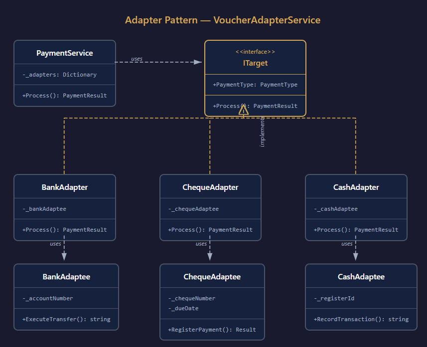

# VoucherAdapterService

A payment processing API that shows the Adapter pattern for integrating multiple payment methods such as Bank, Cheque and Cash with different interfaces into a unified system. I needed to integrate three payment systems that each had their own interfaces.

Instead of polluting the business logic with if, else and currency conversions the Adapter pattern let us wrap each of these behind a common interface:

```csharp
public interface ITarget
{
    PaymentType PaymentType { get; }
    PaymentResult Process(Money amount, string? description = null);
}
```


## Diagram



## Usage

```bash
POST /api/Payment
Content-Type: application/json

{
  "type": 2,
  "amount": 54000,
  "currency": 1,
  "description": "invoice #1234"
}
```

Payment types: `1` = Bank, `2` = Cheque, `3` = Cash

Currency: `1` = Rial, `2` = Toman

Response:
```json
{
  "success": true,
  "data": {
    "transactionId": "CHEQUE-999b2f52a9a4486d92ca25ae988b3cff",
    "success": true,
    "message": "Cheque payment registered"
  },
  "message": "Payment processed successfully"
}
```

## Running

```bash
cd src/Api
dotnet run
```

Swagger UI: https://localhost:7098/swagger

## License

MIT
